# SamaSama.sg Marketing Funnel Plan

> North Star reference for SamaSama marketing assets, funnel decisions, customer messaging, and operational marketing processes.

## 1. Funnel Strategy

SamaSama should use a trust-first funnel, not a standard ecommerce funnel.

The business is not simply selling products online. SamaSama is asking customers to place deposits for group-buy batches, wait for fulfilment, and trust that the products have been carefully sourced from China suppliers.

Because of this, the funnel must do more than drive traffic.

It needs to guide people through a clear journey:

**Discovery → Interest → Trust → Objection Handling → Conversion → Nurture → Advocacy**

The goal is not just to get customers to “buy now.”

The goal is to help customers understand:

* What SamaSama does
* Why group buying creates better pricing
* How products are sourced and selected
* Why deposits are required
* What happens if a batch fails
* What happens if a product is faulty
* Why customers can trust the system enough to place a deposit

For SamaSama, trust is the conversion engine.

Traffic alone will not build the business. Customers need to feel that SamaSama is transparent, careful, reliable, and accountable.

---

## 2. Core Positioning

SamaSama is a group-buy platform that helps everyday customers in Singapore access better pricing on carefully sourced OEM/ODM products from China.

The core idea:

**Premium products. MOQ pricing. No brand tax.**

SamaSama helps customers buy together so they can access pricing usually reserved for larger bulk buyers.

Instead of paying heavily for branding, middlemen, retail markups, and showroom costs, customers can join a group-buy batch and enjoy better value, while SamaSama handles sourcing, supplier coordination, fulfilment, and local support.

However, because “China OEM/ODM” can sound risky or confusing to some customers, the brand must consistently communicate:

* We do not import random cheap products.
* We carefully source and filter products.
* We reject products that do not meet our standards.
* We explain the group-buy process clearly.
* We are transparent about timelines, pricing, deposits, and support.
* We show our work.

The key customer promise:

**We source, check, reject the rubbish, and bring in the good stuff at group-buy prices.**

---

## 3. Funnel Flowchart

```mermaid
flowchart TD
    A[Organic Content Marketing<br/>TikTok, IG Reels, Meta, Shorts] --> B[Discovery<br/>Founder journey, Guangzhou life, factory visits, sourcing stories]

    C[Community / Offline Channels<br/>HDB Telegram, BTO WhatsApp, renovation groups, homeowner communities] --> D[Community Traffic<br/>Admin posts, referral links, group-specific links, product demo posts]

    B --> E[Interest<br/>User visits profile link, website, product page, or active batch]
    D --> E

    E --> F[Website Entry Points<br/>Homepage, Active Batches, Product Batch Page]

    F --> G[Trust Layer<br/>How It Works, FAQ, How We Source, Why Deposits, Product Checks]

    G --> G2[Proof Assets<br/>Testing, supplier context, documentation notes, rejected products, price comparison, founder notes]

    G2 --> G3[Objection Handling<br/>Is this legit? Why so cheap? Is deposit refundable? What if batch fails? What if product is faulty?]

    G3 --> H{Is the user ready to join?}

    H -->|Yes| I[Conversion<br/>Join Batch + Submit Order]
    I --> J[PayNow Deposit<br/>Customer pays deposit using Order ID]

    J --> J2{Deposit Received?}
    J2 -->|Yes| K[Manual Verification<br/>Admin verifies PayNow payment]
    J2 -->|No| J3[Deposit Reminder<br/>Clarify process, refund rules, batch mechanics]
    J3 --> J

    K --> L[Verified Deposit<br/>Order counts toward batch progress]

    H -->|Not yet| M[Lead Capture<br/>Waitlist, Get Notified, Product Vote, WhatsApp Interest List]
    M --> N[Warm Audience<br/>Email / WhatsApp / Retargeting Audience]
    N --> O[Future Batch Announcement<br/>Trust content, product updates, launch reminder]
    O --> I

    L --> P[Nurture Updates<br/>Deposit verified, batch progress, tier unlocks, closing reminders]
    P --> Q[Batch Close<br/>Final price confirmed, balance payment details]
    Q --> R[Fulfilment<br/>Production, procurement, shipping, arrival in Singapore]
    R --> S[Collection / Delivery<br/>Balance payment, pickup, local delivery]

    S --> T[Post-Purchase Trust<br/>Thank you, support, DOA handling, replacement process]
    T --> U[Advocacy<br/>Review, testimonial, UGC, referral]
    U --> V[Sharing Loop<br/>Share batch, unlock next tier, refer friends]
    V --> E

    F --> W[Retargeting Audience<br/>Page viewers, video engagers, form abandoners]
    W --> X[Trust / Reminder Content<br/>FAQ, proof, batch closing, tier unlock, founder explanation]
    X --> I
```

---

## 4. Funnel Layers

---

# Layer 1: Organic Content Marketing

**Funnel stage:** Top / Middle

## Purpose

Create awareness, curiosity, and founder-led trust.

Organic content should not only make people aware of SamaSama. It should help people believe that SamaSama knows how to source properly, understands product quality, and is willing to show the process transparently.

This is where the brand earns attention before asking for deposits.

## Main channels

* TikTok
* Instagram Reels
* Facebook Reels
* YouTube Shorts
* Meta boosted posts
* Founder personal content
* Website content repurposed into short-form videos

## Content examples

* Day in the life of a Singaporean sourcing in Guangzhou
* Factory visits
* Product testing
* Product rejection and red flags
* What to check before trusting a supplier
* How group buys work
* Why some products are not suitable for Singapore homes
* Why we rejected this supplier
* How much “brand tax” customers may be paying
* What MOQ means
* What happens when customers buy together
* What I ask suppliers before considering a product
* Would I bring this product into my own home?

## Recommended recurring content series

### 1. Sourcing Diaries

Founder-led content showing the sourcing journey in China.

Examples:

* “Day in Guangzhou looking for appliances”
* “Factory visit: what I look for”
* “Supplier meeting: the questions I ask”
* “What MOQ actually means”

### 2. Products We Rejected

Trust-building content explaining why SamaSama chose not to import certain products.

Examples:

* “We found a cheaper model, but rejected it.”
* “This product looked good until we checked the details.”
* “Why we will not bring this into Singapore homes.”

### 3. No Brand Tax

Educational content explaining how pricing works.

Examples:

* “Why branded products can cost so much more”
* “What you are really paying for in retail”
* “How group buying helps unlock better pricing”

### 4. Group Buy Explained

Simple content explaining how SamaSama works.

Examples:

* “How SamaSama group buys work in 30 seconds”
* “What happens after you place a deposit”
* “What happens if the batch fails”
* “Why your order only counts after deposit verification”

### 5. Batch Updates

Momentum-building content once a batch is live.

Examples:

* “Batch is now 40% filled”
* “Next price tier is close”
* “48 hours left before batch closes”
* “First batch has arrived”

## Primary goal

Get people curious enough to:

* Follow the sourcing journey
* Visit the website
* Check active batches
* Join the waitlist
* Ask questions
* Share content with others

## Soft CTAs

* “Follow the sourcing journey.”
* “Link in bio for current batches.”
* “Full notes on the site.”
* “Comment what we should test next.”
* “Join the waitlist for the next batch.”
* “Vote for what we should source next.”

---

# Layer 2: Community / Offline Channels

**Funnel stage:** Top / Bottom

## Purpose

Reach concentrated pockets of relevant customers through trusted community spaces.

This is especially important for SamaSama because early buyers are likely to come from communities that already have buying intent.

These may include new homeowners, BTO owners, renovation groups, and estate-based communities.

Community traffic can be warmer than organic social traffic because people in these groups are already discussing home purchases, appliances, renovation needs, and value deals.

## Potential channels

* HDB Telegram groups
* BTO WhatsApp groups
* Renovation communities
* New homeowner groups
* Estate and neighbourhood groups
* Group-buy admin communities
* Home appliance discussion groups
* Facebook renovation groups
* Friends and family referral networks
* Offline demos among warm audiences

## Tactics

* Group-specific links
* Referral codes
* Early access batches
* Community-only first look
* Admin partnerships
* Product demo posts
* Educational posts before sales posts
* Product voting for specific communities
* Launch perks or referral credits

## Community posting rules

SamaSama should avoid appearing spammy in community channels.

Recommended rules:

* Do not drop links cold without context.
* Lead with useful product education.
* Ask admin permission where possible.
* Be transparent that SamaSama is your platform.
* Use group-specific tracking links.
* Tailor product angles to the community.
* Keep proof assets ready.
* Avoid overposting.
* Respond to questions quickly and honestly.
* Track feedback, objections, and complaints.

## Important caution

Be careful with “exclusive community pricing.”

If different groups receive different prices, customers may feel that pricing is unfair or unclear.

A safer approach is to offer community perks instead of hidden price differences.

Examples:

* Early access
* Priority product voting
* Referral credits
* Launch credits
* Community-specific tracking links
* Free delivery unlock if group target is reached

## Primary goal

Drive warmer traffic directly to:

* Product batch pages
* Active batch listings
* Waitlist forms
* Product voting pages
* WhatsApp interest lists

---

# Layer 3: Website Trust Layer

**Funnel stage:** Middle

## Purpose

Convert curiosity into confidence.

The website must not only display products. It must explain the full SamaSama system clearly.

For many customers, the website will be the place where they decide whether the business is legitimate enough for them to place a deposit.

## Core pages

* Homepage
* Active Batches
* Product Batch Page
* How It Works
* FAQ
* How We Source
* Why Deposits
* Product Checks
* Product Selection Criteria
* Refunds & Replacements
* Collection & Delivery
* Batch Timeline
* About / Founder Story
* Order Lookup

## Trust questions to answer

* Who is behind SamaSama?
* What does SamaSama do?
* How does the group buy work?
* Why is the product cheaper?
* Why is a deposit needed?
* Is the deposit refundable?
* What happens if the batch fails?
* When do I pay the balance?
* How is the final price confirmed?
* How are products selected?
* What checks are done before a product is listed?
* Are the products suitable for Singapore homes?
* What happens if the product is faulty?
* How do I collect my item?
* Is delivery available?
* How can I track my order?

## Website principle

Every key customer fear should be answered before the payment step.

The product page should not only sell the product. It should sell confidence in the process.

---

# Layer 4: Proof Assets Layer

**Funnel stage:** Middle / Bottom

## Purpose

Turn claims into proof.

SamaSama should avoid relying only on generic trust statements like “carefully sourced” or “premium quality.”

Instead, each batch should include visible proof that the product was selected with care.

## Trust assets to create for each batch

* Founder product selection note
* Supplier or factory context
* Product testing photos/videos
* Product red flag checklist
* Safety/documentation notes
* Price comparison against retail alternatives
* Explanation of why this product was selected
* Explanation of why cheaper alternatives were rejected
* Supplier conversation snippets, where appropriate
* Product sample photos
* Product usage videos
* Batch progress updates
* Collection day proof
* Customer reviews
* Testimonials
* UGC after fulfilment

## Examples of proof-led content

* “Why we selected this model”
* “What we checked before listing this product”
* “Why we rejected the cheaper version”
* “How this compares to branded alternatives”
* “What documents we requested from the supplier”
* “What to know before joining this batch”

## Primary goal

Make each product campaign feel transparent, researched, and credible.

Every product batch should have enough proof for a cautious customer to feel that SamaSama has done the homework.

---

# Layer 5: Objection Handling Layer

**Funnel stage:** Middle / Bottom

## Purpose

Remove the main reasons customers hesitate before placing a deposit.

This is one of the most important layers in the funnel because SamaSama’s model naturally creates questions.

Customers are not only evaluating the product. They are evaluating the business model, the founder, the fulfilment process, and the risk of placing a deposit.

## Core objections to address

* Is SamaSama legitimate?
* Why are the products cheaper?
* Are China OEM/ODM products reliable?
* Are the products safe for Singapore homes?
* Why is a deposit required?
* Is the deposit refundable?
* What happens if the batch fails?
* What happens if the product is faulty?
* How long will fulfilment take?
* Why not just buy from Shopee, Taobao, or retail?
* What if the final price changes?
* Can I cancel?
* Who handles support after purchase?
* What if I miss the collection date?

## Where this should appear

* Product batch pages
* FAQ
* How It Works
* Why Deposits
* Payment instructions
* WhatsApp replies
* Email reminders
* Retargeting content
* Social posts
* Community group replies

## Primary goal

Reduce hesitation before deposit payment.

The customer should feel that SamaSama has already anticipated their concerns and answered them clearly.

---

# Layer 6: Lead Capture Layer

**Funnel stage:** Middle

## Purpose

Capture people who are interested but not ready to place a deposit yet.

Not every interested customer will join immediately. Some may want to wait for a different product, ask their spouse, compare alternatives, or simply observe the first few batches.

SamaSama should not waste this traffic.

## Lead capture options

* Join waitlist
* Get notified when next batch opens
* Vote for next product
* Join sourcing updates
* Newsletter signup
* WhatsApp interest list
* Product-specific interest form

## Suggested fields

For lower-friction forms:

* Email or WhatsApp number
* Product interest

For higher-intent forms:

* Name
* Email
* WhatsApp number
* Product category interest
* Where did you hear about us?

## Recommended approach

Use lighter forms for colder traffic and more detailed forms for warmer traffic.

For example, a product voting form should first let the customer vote, then ask:

“Want us to notify you if this product goes live?”

This feels less intrusive than asking for too much information upfront.

## Primary goal

Build a warm audience without relying only on paid ads.

---

# Layer 7: Conversion Layer

**Funnel stage:** Bottom

## Purpose

Turn trust into verified deposits.

For SamaSama, the true conversion is not a website visit, button click, or form submission.

The true conversion is a verified deposit.

## Conversion actions

* Join this batch
* Submit order
* Receive Order ID
* Pay PayNow deposit
* Admin verifies payment
* Order counts toward batch progress

## Important conversion reassurance

The product batch page and payment instructions should clearly explain:

* Deposit is refundable if the batch fails.
* Only verified deposits count toward the batch.
* Final price depends on batch progress.
* Customer can track order status.
* Collection and delivery details will be provided.
* Balance payment is only collected after the batch outcome is confirmed.
* Support is available if customers are unsure.

## Abandoned deposit recovery

Some customers will submit the order form but not complete the PayNow deposit.

This should be treated as a specific recovery stage.

Possible follow-up message:

“Hey, we received your order for the batch, but your deposit has not been verified yet. Just a reminder that your slot only counts after deposit verification. If you have any questions about the deposit, refund process, or batch timeline, feel free to reply here.”

## Primary metric

**Verified deposits**

Secondary conversion metrics:

* Join button clicks
* Form starts
* Form submissions
* Pending PayNow orders
* Deposit verification rate
* Drop-off between form submission and deposit
* Source of verified deposits

---

# Layer 8: Nurture Layer

**Funnel stage:** Post-conversion

## Purpose

Keep customers calm, informed, and engaged during the group-buy timeline.

After a customer places a deposit, silence creates anxiety.

Customers need to feel that the batch is moving, their money is accounted for, and SamaSama is actively managing the process.

## Update types

### Operational updates

These reduce anxiety.

* Order received
* Deposit pending
* Deposit verified
* Batch closed
* Final price confirmed
* Balance payment instructions
* Procurement update
* Shipment update
* Arrival in Singapore
* Collection ready
* Delivery instructions
* Support instructions

### Momentum updates

These encourage sharing and excitement.

* Batch is 25% filled
* Batch is 50% filled
* Next price tier is close
* New tier unlocked
* Batch closing in 48 hours
* Final call to join
* Share with friends to unlock better pricing

## Manual update moments

* Order received
* Deposit pending
* Deposit verified
* Batch progress update
* New tier unlocked
* Batch closing soon
* Final price confirmed
* Shipment update
* Collection ready
* Post-collection thank you

## Primary goal

Reduce anxiety, increase confidence, and encourage customers to share the batch while it is still live.

---

# Layer 9: Advocacy / Referral Layer

**Funnel stage:** Growth loop

## Purpose

Turn buyers and interested users into distribution.

For SamaSama, advocacy and referral are both important, but they serve slightly different purposes.

Advocacy creates proof.

Referral creates reach.

## Advocacy mechanics

* Customer reviews
* Testimonials
* UGC after collection
* Product usage photos/videos
* Collection day content
* Before/after product experience
* Comments from real buyers
* Founder reposts of customer feedback

## Referral mechanics

* Share batch link
* Refer a friend
* Help unlock next price tier
* Store credit for successful referrals
* Referral codes
* Group-sharing prompts
* Community batch sharing

## Core message

“When more people join, everyone moves closer to a better final price.”

## Important note

For early-stage SamaSama, advocacy may be more valuable than referral incentives.

A real customer saying:

“I joined the batch, received my item, and the process was legit”

is more valuable than a generic discount campaign.

## Primary goal

Use every completed batch to create proof for the next batch.

---

## 5. Key Metrics to Track

---

# Organic Content Metrics

* Video views
* Watch time
* Completion rate
* Profile visits
* Link-in-bio clicks
* Comments asking about product or batch
* Saves
* Shares
* Follows
* DM enquiries
* Content topic performance

## Key question

Which content creates trust and sends qualified traffic to the website?

---

# Website Metrics

* Homepage visits
* Active batch page views
* Product page views
* How It Works page views
* FAQ page views
* Why Deposits page views
* Product Checks page views
* Join button clicks
* Form starts
* Form submissions
* Order lookup usage
* Returning visitors
* Product page conversion rate

## Key question

Which pages help customers move from curiosity to deposit?

---

# Conversion Metrics

* Pending PayNow orders
* Verified deposits
* Deposit verification rate
* Drop-off between form submission and deposit
* Source of verified deposits
* Cost per verified deposit
* Verified deposits by product
* Verified deposits by channel
* Time from order submission to deposit
* Abandoned deposit recovery rate

## Key question

Where are interested customers dropping off before verified deposit?

---

# Community Channel Metrics

* Group posted in
* Admin/contact person
* Post date
* Link/code used
* Clicks
* Orders
* Verified deposits
* Conversion rate by group
* Cost, if any
* Comments/questions received
* Complaints or negative feedback
* Repeat performance from same group

## Key question

Which communities produce verified deposits without damaging trust?

---

# Lead Capture Metrics

* Waitlist signups
* Product votes
* Email signups
* WhatsApp interest signups
* Category interest
* Source of lead
* Lead-to-deposit conversion rate
* Batch announcement open/reply rate

## Key question

Which product categories and audiences show the strongest buying intent?

---

# Advocacy Metrics

* Referral link shares
* Referred orders
* Referred verified deposits
* Testimonials collected
* UGC posts
* Repeat buyers
* Review rate
* Referral conversion rate
* Post-purchase satisfaction

## Key question

Are successful batches producing proof and distribution for future batches?

---

# Batch Economics Metrics

* Batch fill rate
* Days to MOQ
* Number of verified deposits per batch
* Final tier unlocked
* Gross margin per batch
* Refund rate
* Replacement/DOA rate
* Support tickets per batch
* Cash conversion timeline
* Fulfilment delay rate

## Key question

Is each batch commercially healthy and operationally manageable?

---

## 6. Pilot Launch Priorities

For the pilot, SamaSama should not overbuild the funnel.

The first objective is not to create a perfect marketing machine.

The first objective is to prove that strangers will place verified deposits through a trust-first group-buy funnel.

## Pilot priority order

1. One hero product
2. One strong product batch page
3. One clean How It Works page
4. One clear FAQ / Why Deposits page
5. One founder intro or trust video
6. Organic content route
7. Community group route
8. Manual source tracking
9. Manual deposit verification
10. Manual customer updates
11. Waitlist capture
12. Collect proof aggressively after fulfilment

---

# Pilot Route 1: Organic Content Route

## Flow

TikTok / IG / Reels → Bio link → Website → Product page → Join batch or waitlist

## Purpose

Test whether founder-led content can create curiosity, trust, and traffic.

## What to measure

* Video views
* Profile visits
* Link clicks
* Product page visits
* Waitlist signups
* Verified deposits

---

# Pilot Route 2: Community Group Route

## Flow

HDB / renovation / homeowner group post → Product page → Join batch → Pay deposit → Manual source tracking

## Purpose

Test whether concentrated community traffic can convert faster than cold organic traffic.

## What to measure

* Clicks by group
* Orders by group
* Verified deposits by group
* Questions asked
* Objections raised
* Admin feedback
* Negative comments, if any

---

# Pilot Route 3: Website Trust Route

## Flow

Homepage / Product page → How It Works / FAQ / Why Deposits → Join batch

## Purpose

Test whether the website can answer enough questions to convert cautious customers.

## What to measure

* FAQ page views
* How It Works views
* Why Deposits views
* Join button clicks
* Form submissions
* Deposit completion rate

---

# Pilot Route 4: Waitlist Route

## Flow

Interested but not ready → Waitlist / Product vote / WhatsApp interest list → Future batch announcement → Join batch

## Purpose

Capture demand that does not convert immediately.

## What to measure

* Waitlist signups
* Product votes
* Category interest
* Announcement response rate
* Lead-to-deposit conversion rate

---

# Pilot Route 5: Referral / Sharing Route

## Flow

Verified buyer → Share batch → Friend visits page → Friend joins batch → More buyers unlock better pricing

## Purpose

Use the group-buy mechanism to encourage sharing.

## What to measure

* Referral shares
* Referred visitors
* Referred orders
* Referred verified deposits
* Tier unlock impact

---

## 7. Recommended First Campaign Strategy

SamaSama should launch with one hero product, not too many SKUs.

The first campaign should be designed to prove the business model, not maximise product variety.

## Ideal first product criteria

The first product should be:

* Easy to understand
* Useful for Singapore homes
* Visibly demonstrable in content
* Strong enough for comparison against branded alternatives
* Not too complicated operationally
* Not too risky from a safety or regulatory perspective
* Capable of creating strong perceived value
* Reasonable to fulfil and support
* Able to generate customer reviews and UGC

## First campaign objective

The first batch should create:

* Verified deposits
* Customer trust
* Fulfilment proof
* Testimonials
* UGC
* Collection photos
* Real customer feedback
* Proof that the group-buy model works
* Learnings for the next batch

The first campaign should not be judged only by profit.

It should be judged by whether it creates enough proof to make the second campaign easier.

---

## 8. Content Strategy by Funnel Stage

---

# Discovery Content

## Goal

Get attention and make people curious.

## Content examples

* “I’m sourcing products in Guangzhou for Singapore homes.”
* “Why are some branded products so expensive?”
* “What does MOQ mean?”
* “How group buys can unlock better pricing.”
* “Factory visit day.”
* “This is what sourcing actually looks like.”

## CTA

* Follow the journey
* Watch the full breakdown
* Comment what we should source next

---

# Trust Content

## Goal

Make people believe SamaSama is careful and transparent.

## Content examples

* “What we check before importing a product.”
* “Why we rejected this model.”
* “What supplier documents we asked for.”
* “The red flags we look out for.”
* “Would I bring this into my own home?”
* “How this product compares to branded alternatives.”

## CTA

* Read the product notes
* See how we source
* View current batch
* Ask us anything

---

# Conversion Content

## Goal

Get interested customers to place a deposit.

## Content examples

* “Batch is now open.”
* “Here’s how to join.”
* “What happens after you place a deposit.”
* “Deposit is refundable if the batch fails.”
* “Next price tier unlock is close.”
* “Batch closes in 48 hours.”

## CTA

* Join this batch
* Place deposit
* Reserve your slot
* Help unlock the next tier

---

# Nurture Content

## Goal

Reassure customers after deposit.

## Content examples

* “Deposit verified.”
* “Batch update: we are now 60% filled.”
* “Next tier unlocked.”
* “Batch has closed.”
* “Shipment is being prepared.”
* “Goods have arrived in Singapore.”
* “Collection details are ready.”

## CTA

* Track your order
* Share this batch
* Check your collection details

---

# Advocacy Content

## Goal

Turn completed orders into proof.

## Content examples

* “Batch 001 fulfilled.”
* “Customer collection day.”
* “What buyers said after receiving their item.”
* “Real review from a SamaSama customer.”
* “What we learned from our first batch.”
* “Next batch is now open.”

## CTA

* Leave a review
* Share your setup
* Refer a friend
* Join the next batch

---

## 9. Customer Update Framework

Because group-buy customers wait longer than normal ecommerce customers, updates should be treated as part of the product experience.

## Recommended update points

### After order submission

Message:

“Your order has been received. Your slot will count toward the batch once your PayNow deposit has been verified.”

### After deposit verification

Message:

“Your deposit has been verified. Your order now counts toward the batch progress.”

### During batch progress

Message:

“The batch is currently at X%. We need Y more verified orders to unlock the next price tier.”

### Before batch closes

Message:

“This batch is closing soon. If you know someone who may be interested, sharing the batch can help everyone move closer to a better final price.”

### After batch closes

Message:

“The batch has closed. The final price is confirmed at $X. We will share the next payment and fulfilment steps shortly.”

### During fulfilment

Message:

“Procurement/shipping is in progress. We will update you once the shipment reaches Singapore.”

### When ready for collection

Message:

“Your item is ready for collection/delivery. Please follow the instructions below to complete balance payment and arrange collection.”

### After collection

Message:

“Thank you for joining this SamaSama batch. If everything is working well, we’d appreciate a short review or photo. It helps future buyers trust the process.”

---

## 10. Operational Notes for Marketing

For SamaSama, operations and marketing should not be separated.

Every operational step can become marketing content.

## Examples

### Supplier sourcing

Can become:

* Factory visit content
* Supplier question content
* Product selection content

### Product testing

Can become:

* Product demo content
* Red flag checklist
* Founder review

### Rejected products

Can become:

* Trust-building content
* “Why we rejected this” series

### Batch progress

Can become:

* Momentum content
* Referral prompts
* Tier unlock updates

### Fulfilment

Can become:

* Behind-the-scenes logistics content
* Arrival updates
* Collection day proof

### Customer support

Can become:

* FAQ improvements
* Objection handling content
* Trust-building case studies

## Core principle

Every product sourced is content.

Every rejected product is trust.

Every batch update is momentum.

Every fulfilled order is proof.

Every customer question is future FAQ content.

---

## 11. Main Risks and How to Manage Them

---

# Risk 1: Customers think SamaSama is just selling cheap China products

## Mitigation

Lead with curation, safety checks, product selection, rejection criteria, and transparency.

Avoid positioning only around “cheap.”

Use:

**Better value through group buying**

instead of:

**Cheap products from China**

---

# Risk 2: Customers do not understand group buying

## Mitigation

Repeat the group-buy explanation everywhere.

Use simple language:

1. Join the batch.
2. Place deposit.
3. If enough people join, we proceed.
4. If the batch fails, deposit is refunded.
5. If the batch succeeds, final price is confirmed.
6. Pay balance.
7. Collect or receive delivery.

---

# Risk 3: Customers are afraid of deposits

## Mitigation

Make deposit rules highly visible.

Place refund reassurance near payment instructions.

Explain:

* Why deposit is needed
* When it is refundable
* What happens if the batch fails
* When it becomes non-refundable
* How refunds are processed

---

# Risk 4: Customers get anxious after paying deposit

## Mitigation

Use regular updates.

Even if there is no major change, communicate the current status.

Silence creates doubt.

---

# Risk 5: Community channels perceive SamaSama as spam

## Mitigation

Lead with useful education.

Get admin permission where possible.

Use tailored posts.

Avoid repetitive link dumping.

Be transparent about being the founder/operator.

---

# Risk 6: First batch fails to hit MOQ

## Mitigation

Frame the first batch as a transparent pilot.

If the batch fails, process refunds quickly and publicly communicate that the system worked as promised.

A failed batch with smooth refunds can still build trust.

---

# Risk 7: Product issues after fulfilment

## Mitigation

Have clear DOA, replacement, and support processes.

Do not hide issues.

Handle them quickly and turn good recovery into trust-building proof.

---

## 12. Simple Funnel Summary

Organic content creates attention and founder trust.

Community channels create concentrated, warmer traffic.

Trust pages and proof assets reduce fear around deposits, sourcing, safety, refunds, and fulfilment.

Product batch pages convert interest into verified deposits.

Manual updates keep customers calm and engaged while the batch progresses.

Group-buy mechanics encourage customers to share because more buyers can unlock better pricing.

Successful fulfilment creates testimonials, UGC, and proof for the next batch.

Every completed batch becomes marketing fuel for the next one.

---

## 13. Strategic Closing

SamaSama should not try to look like a normal ecommerce store.

A normal ecommerce store hides the messy parts.

SamaSama should show the work.

The sourcing, supplier checks, product testing, rejected products, batch progress, and fulfilment updates are not just operational details.

They are the marketing engine.

The strongest brand message is:

**We know you are cautious. You should be. That is why we show our work.**

If SamaSama can own transparency, curation, group-buy leverage, and founder-led trust, the funnel becomes more than a sales path.

It becomes the brand itself.
